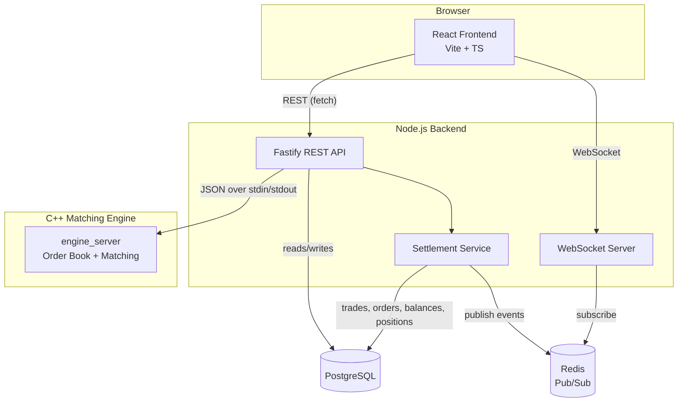

# Paper Trading Platform

A real-time paper (simulated) trading platform with a custom C++ matching engine, a Node.js/TypeScript backend, and a React frontend — built end-to-end to practice systems-level engineering: order matching, transactional settlement, real-time data distribution, and full-stack integration.

**Live demo:** _(add a link here if you deploy it, otherwise remove this line)_


## What it does

Users register, get a virtual ₹10,00,000 cash balance, and can place market/limit buy and sell orders against a small set of simulated instruments (AAPL, TSLA, RELIANCE, TCS, INFY) with live, randomly-walking prices. Orders are matched by a custom-built C++ matching engine using price-time priority — the same algorithmic approach real exchanges use. Trades settle transactionally: cash moves, positions update with average-cost basis, and both sides of a trade are notified in real time over WebSocket.

## Architecture



**Why a separate C++ engine instead of matching in Node?** Matching engines are a classic systems-design problem — deterministic, single-threaded-per-book, and performance-sensitive. Writing it in C++ was a deliberate choice to practice that domain directly rather than abstracting it away, and to keep the "hard part" isolated and independently testable (37 unit tests, GoogleTest).

**Why Postgres is the source of truth, not the engine.** The engine's order book lives entirely in memory — fast, but volatile. Every order is persisted to Postgres *before* being sent to the engine, so if the engine (or the whole backend) restarts, open limit orders are replayed back into a fresh engine process on startup, rebuilding the exact same book with zero new trades.

**Why Redis sits between the engine's output and WebSocket clients.** Price ticks and trade/order events are published to Redis channels rather than broadcast directly from in-process code — this means the real-time layer isn't tied to a single backend process, which matters if this were ever scaled to multiple instances behind a load balancer.

## Tech stack

| Layer | Technology |
|---|---|
| Matching engine | C++20, CMake, GoogleTest |
| Backend | Node.js, TypeScript, Fastify, Drizzle ORM |
| Database | PostgreSQL |
| Real-time | WebSocket (`ws`), Redis pub/sub |
| Frontend | React 19, TypeScript, Vite, React Router, TradingView Lightweight Charts |
| Infra (dev) | Docker Compose (Postgres + Redis) |

## Key engineering decisions

- **Price-time priority matching** — bids sorted descending, asks ascending (`std::map` with a custom comparator), each price level a FIFO queue (`std::deque`), so earlier orders at the same price always match first.
- **Trades execute at the resting order's price**, not the incoming order's — standard exchange behavior, verified with tests.
- **Integer-cents arithmetic throughout the backend** for all money math, to avoid floating-point rounding errors on financial calculations.
- **Funds and shares are reserved before an order reaches the engine** — a market buy gets a computed price cap so a user can never spend more than they have; a sell is checked against shares held minus shares already committed to other open sell orders.
- **One Postgres transaction per settlement** — a trade, both orders' status updates, both accounts' cash, and both positions' average-cost/realized-P&L all commit together or not at all.
- **Average-cost position tracking** with realized P&L booked on every sell, and live unrealized P&L computed on read against the current market price — never stored, since it's only ever valid for the instant it's computed.

## Project structure

```
engine/     C++ matching engine (CMake build, GoogleTest suite)
backend/    Fastify API, Drizzle/Postgres, Redis, WebSocket server
frontend/   React + Vite client
```

## Running locally

**Prerequisites:** Node.js, a C++20 compiler, CMake, Docker.

```bash
# 1. Start Postgres + Redis
docker compose up -d

# 2. Build the matching engine
cmake -S engine -B engine/build
cmake --build engine/build

# 3. Run backend migrations, then start the backend
cd backend
npx drizzle-kit migrate
npm run build && node dist/index.js

# 4. Start the frontend
cd ../frontend
npm run dev
```

## Status

All core functionality (auth, accounts, instruments, live market data, order matching, settlement, positions/P&L, real-time updates, and the full frontend) is complete and manually verified end-to-end. See [`docs/demo-script.md`](docs/demo-script.md) for a guided walkthrough.